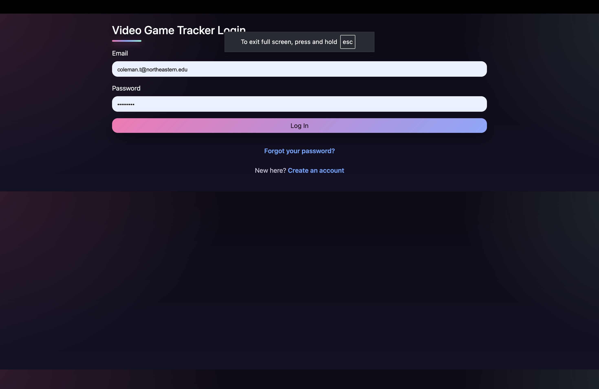
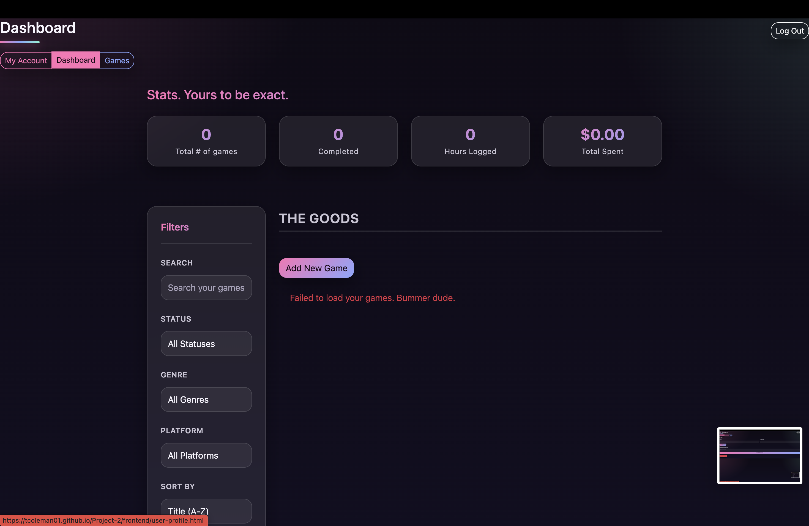
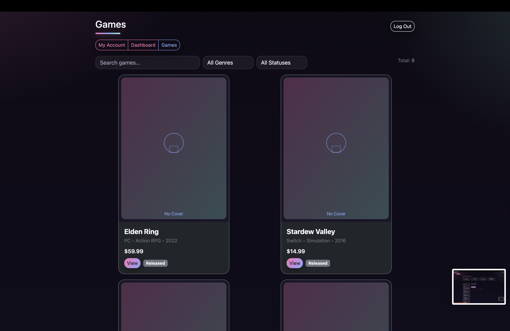
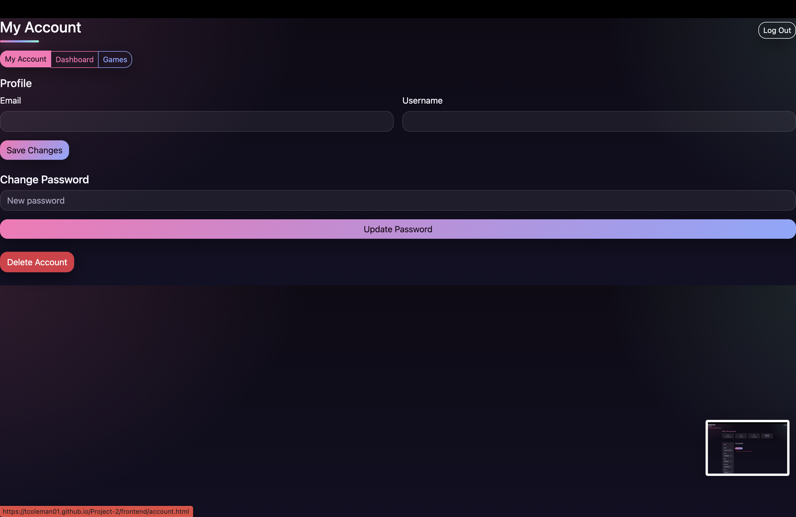

🎮 Personal Video Game Tracker

Authors: Theresa Coleman, Stewart Almeida
Course: CS5610 • Project 2

🧭 Objective

A full-stack web app that lets users track their video games — log hours played, money spent, and share reviews with the community.

🌐 Live Demo

Deployed URL: https://tcoleman01.github.io/Project-2/

Narrated Video (2–3 min): 
Theresa's Video: https://youtu.be/pj_9FvMdd6w
Stewart's Video: https://youtu.be/JOPdEuMu4Xc

🖼️ Screenshot

⚙️ Tech Stack

Frontend: HTML5, CSS, vanilla JavaScript (no frameworks)

Backend: Node.js, Express, MongoDB (native driver only — no Mongoose)

Auth: JWT-based authentication with secure HttpOnly cookies

Database: 2+ MongoDB collections (users, mock_games, mock_reviews, mock_user_games)

Lint/Format: ESLint + Prettier

License: MIT

🔐 Authentication Overview

Full user account system implemented via routes/users.js

Passwords stored using bcrypt hashing

Auth flow:

POST /register → create a new account

POST /login → sets JWT auth cookie

GET /me → fetch current user info (requires login)

POST /logout → clears session cookie

POST /change-password and PATCH /me for user updates

Protected routes enforced using middleware/auth.js

Environment variables:

MONGODB_URI=mongodb://127.0.0.1:27017/videogameTracker
MONGODB_DB=videogameTracker
PORT=3000
JWT_SECRET=dev-secret-change-this

🧠 Features

Create and manage a personal game list

Add community reviews and ratings

Track total hours played and spending

Authentication-protected user profiles

Large dataset support (≥1000 games)

Organized modular backend with separated routes and DB logic

💻 Run Locally
npm install
# ensure MongoDB is running locally
cp .env.example .env
npm start
# visit http://localhost:3000
